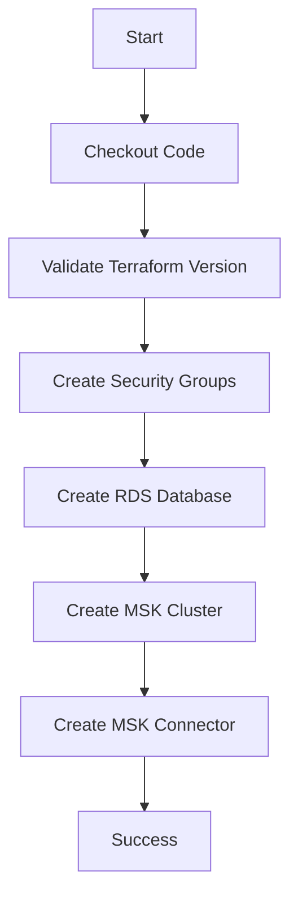
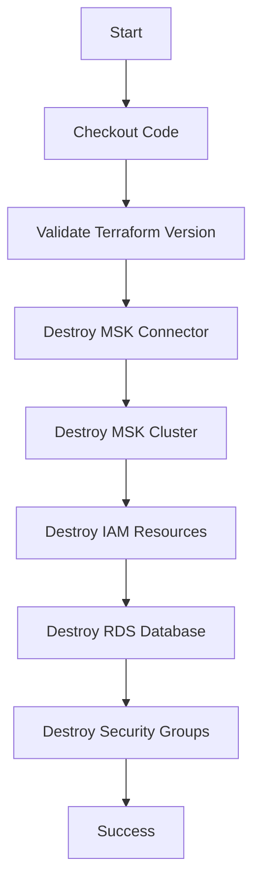

# Jenkins Pipeline Quick Reference Guide

## Overview

This Jenkins pipeline automates the deployment and destruction of AWS MSK infrastructure with proper dependency management.

## Pipeline Parameters

| Parameter | Type | Options | Description |
|-----------|------|---------|-------------|
| `ACTION` | Choice | `apply`, `destroy` | Select whether to create or destroy resources |
| `AUTO_APPROVE` | Boolean | `true`, `false` | Skip manual approval prompts (default: false) |

## Execution Flow

### CREATE Mode (ACTION = apply)



**Stages:**
1. ✅ Checkout repository
2. ✅ Validate Terraform version
3. 🔐 **Create Security Groups** - Creates sg for RDS, MSK, and Connectors
4. 🗄️ **Create RDS Database** - Deploys Aurora MySQL cluster
5. 📡 **Create MSK Cluster** - Deploys Kafka cluster, CloudWatch logs, and IAM roles
6. 🔌 **Create MSK Connector** - Deploys Debezium CDC connector

### DESTROY Mode (ACTION = destroy)



**Stages:**
1. ✅ Checkout repository
2. ✅ Validate Terraform version
3. 🔌 **Destroy MSK Connector** - Removes connector resources
4. 📡 **Destroy MSK Cluster** - Removes MSK cluster and logs
5. 🔐 **Destroy IAM Resources** - Removes IAM roles and policies
6. 🗄️ **Destroy RDS Database** - Removes RDS cluster
7. 🛡️ **Destroy Security Groups** - Removes all security groups

## Usage Examples

### Example 1: Create Infrastructure with Manual Approval

1. Navigate to Jenkins job
2. Click "Build with Parameters"
3. Set:
   - `ACTION` = `apply`
   - `AUTO_APPROVE` = `false` (unchecked)
4. Click "Build"
5. Approve each stage manually when prompted

### Example 2: Create Infrastructure with Auto-Approval

1. Navigate to Jenkins job
2. Click "Build with Parameters"
3. Set:
   - `ACTION` = `apply`
   - `AUTO_APPROVE` = `true` (checked)
4. Click "Build"
5. Pipeline runs without manual intervention ⚠️ **Use with caution!**

### Example 3: Destroy Infrastructure

1. Navigate to Jenkins job
2. Click "Build with Parameters"
3. Set:
   - `ACTION` = `destroy`
   - `AUTO_APPROVE` = `false` (recommended)
4. Click "Build"
5. Approve each destruction stage manually

## Stage Details

### Create Security Groups Stage
- **Duration**: ~2-3 minutes
- **Resources Created**:
  - `rds-sg` - RDS security group
  - `msk-sg` - MSK cluster security group
  - `connector-sg` - MSK connector security group
- **Dependencies**: None

### Create RDS Stage
- **Duration**: ~10-15 minutes
- **Resources Created**:
  - Aurora MySQL cluster
  - DB subnet group
  - Cluster and instance parameter groups
- **Dependencies**: Security Groups

### Create MSK Cluster Stage
- **Duration**: ~15-20 minutes
- **Resources Created**:
  - MSK cluster (3 broker nodes)
  - CloudWatch log group
  - MSK cluster configuration
  - IAM role and policy
- **Dependencies**: Security Groups, RDS

### Create MSK Connector Stage
- **Duration**: ~5-10 minutes
- **Resources Created**:
  - Custom plugin (Debezium)
  - Worker configuration
  - MSK Connect connector
- **Dependencies**: MSK Cluster, RDS, S3 bucket with plugin

## Terraform Targets Used

### MSK Cluster Creation Targets
```
- aws_cloudwatch_log_group.msk_log_group
- aws_msk_configuration.cluster_configuration
- aws_msk_cluster.msk_cluster
- aws_iam_role.msk_role
- aws_iam_policy.msk_policy
- aws_iam_role_policy_attachment.attach_msk_policy
```

### MSK Connector Creation Targets
```
- aws_mskconnect_custom_plugin.connector_plugin_debezium
- aws_mskconnect_worker_configuration.connector_configuration
- aws_mskconnect_connector.msk_cdc_connector
```

## Troubleshooting

### Issue: Pipeline Fails at Security Groups Stage
**Cause**: VPC or subnets not properly tagged
**Solution**: Ensure your VPC is tagged with `Name: default-vpc` and subnets with `Name: public-subnet-*`

### Issue: MSK Connector Creation Fails
**Cause**: Debezium plugin not found in S3
**Solution**: Run the GitHub Actions workflow first to upload the plugin to S3

### Issue: RDS Connection Failed
**Cause**: Security group rules not allowing connector access
**Solution**: Verify security group rules in `terraform/sg/sg.tf`

### Issue: Terraform State Locked
**Cause**: Previous run didn't complete properly
**Solution**: 
```bash
# Remove state lock from DynamoDB or wait for timeout
terraform force-unlock <LOCK_ID>
```

### Issue: "No changes" but resources don't exist
**Cause**: Terraform state out of sync with actual infrastructure
**Solution**:
```bash
# Import existing resources or refresh state
terraform state list
terraform refresh
```

## Best Practices

1. ✅ **Always use manual approval for production** (`AUTO_APPROVE = false`)
2. ✅ **Review Terraform plan output** before approving
3. ✅ **Monitor CloudWatch logs** during and after deployment
4. ✅ **Test in dev environment first** before production deployment
5. ✅ **Keep backups** of Terraform state files
6. ✅ **Use version control** for infrastructure changes
7. ⚠️ **Avoid manual changes** to resources managed by Terraform
8. ⚠️ **Check costs** before deploying (MSK and RDS are expensive)

## Pipeline Execution Time

| Stage | Typical Duration |
|-------|-----------------|
| Security Groups | 2-3 minutes |
| RDS Database | 10-15 minutes |
| MSK Cluster | 15-20 minutes |
| MSK Connector | 5-10 minutes |
| **Total (Create)** | **~35-50 minutes** |
| **Total (Destroy)** | **~20-30 minutes** |

## AWS Resources Created

| Service | Resource Type | Quantity | Approx Monthly Cost |
|---------|--------------|----------|---------------------|
| MSK | kafka.t3.small | 3 brokers | ~$150-200 |
| RDS | db.t3.small Aurora | 1 instance | ~$50-70 |
| S3 | Standard storage | 1 bucket | <$5 |
| CloudWatch | Log groups | 2 groups | ~$5-10 |
| IAM | Roles/Policies | 2 roles | Free |
| **TOTAL** | | | **~$210-285/month** |

> ⚠️ **Important**: Remember to destroy resources when not in use to avoid unnecessary costs!

## Jenkins Job Configuration

### Recommended Settings

```groovy
// Jenkins Job Configuration
- Build Triggers: None (manual trigger only)
- Pipeline: Pipeline script from SCM
- SCM: Git
- Repository URL: <your-repo-url>
- Script Path: Jenkinsfile
- Lightweight checkout: Enabled
```

### Required Plugins

- Git plugin
- Pipeline plugin
- AWS credentials plugin (if using Jenkins credentials)

### Required Jenkins Credentials

If not using IAM instance role:
- **AWS_ACCESS_KEY_ID** - AWS access key
- **AWS_SECRET_ACCESS_KEY** - AWS secret key
- **AWS_DEFAULT_REGION** - us-east-1

## Cleanup

To completely destroy all resources:

1. Run pipeline with `ACTION = destroy`
2. Verify all resources are destroyed in AWS Console
3. Clean up S3 buckets manually if needed:
   ```bash
   aws s3 rm s3://aws-msk-resources-bucket --recursive
   aws s3 rb s3://aws-msk-resources-bucket
   ```
4. Remove Terraform state from S3 if no longer needed

## Support

For issues or questions:
1. Check AWS CloudWatch logs
2. Review Terraform state: `terraform show`
3. Validate configurations: `terraform validate`
4. Check Jenkins console output for detailed error messages

## Additional Resources

- [AWS MSK Documentation](https://docs.aws.amazon.com/msk/)
- [Debezium Documentation](https://debezium.io/documentation/)
- [Terraform AWS Provider](https://registry.terraform.io/providers/hashicorp/aws/latest/docs)
- [Jenkins Pipeline Syntax](https://www.jenkins.io/doc/book/pipeline/syntax/)

