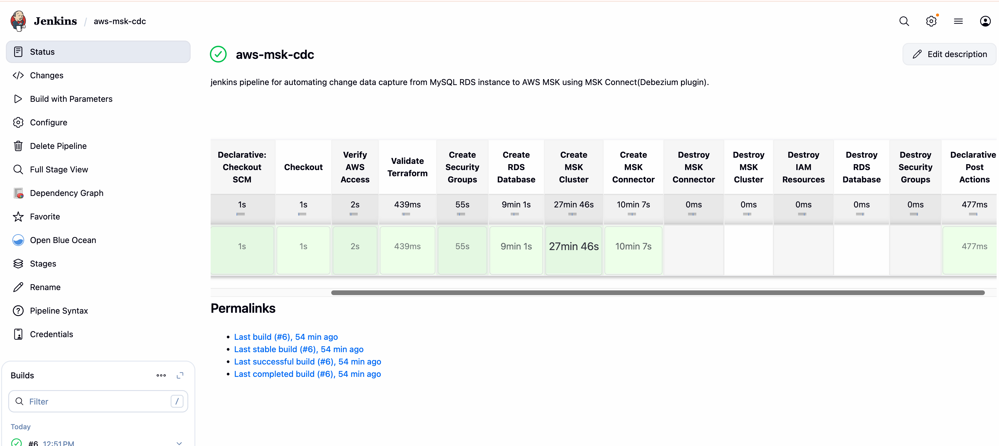
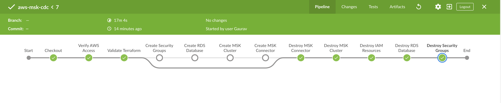

 # AWS MSK (Managed Services For Kafka) Pipeline

This repository contains Terraform configurations and Jenkins pipeline for deploying AWS MSK (Managed Streaming for Apache Kafka) with RDS CDC (Change Data Capture) using Debezium connector.

## Architecture

The infrastructure is deployed in the following order:

1. **Security Groups** (`terraform/sg/`) - Network security configurations for RDS, MSK, and Connectors
2. **RDS Aurora MySQL** (`terraform/rds/`) - Source database for CDC
3. **MSK Cluster** (`terraform/msk/`) - Managed Kafka cluster
4. **MSK Connector** (`terraform/msk/`) - Debezium CDC connector

## Prerequisites

- Jenkins server with:
  - Terraform v1.11 installed
  - AWS credentials stored in Jenkins (see Quick Start below)
  - Git plugin
- AWS Account with appropriate permissions
- S3 bucket for Terraform state (`terraform-state-bucket-dops`)
- Debezium plugin uploaded to S3 (use `.github/workflows/cicd.yml` workflow)

## 🚀 Quick Start

**New to this project? Follow these steps:**

### Step 1: Add AWS Credentials to Jenkins (5 minutes)

**Add AWS credentials to Jenkins:**

1. Jenkins → Manage Jenkins → Manage Credentials → (global) → Add Credentials
2. Add first credential:
   - **Kind**: Secret text
   - **ID**: `aws-access-key-id`
   - **Secret**: Your AWS Access Key ID
3. Add second credential:
   - **Kind**: Secret text
   - **ID**: `aws-secret-access-key`
   - **Secret**: Your AWS Secret Access Key

> 💡 **Getting AWS credentials:** Go to AWS Console → IAM → Users → Your User → Security credentials → Create access key

### Step 2: Run the Pipeline

1. Go to your Jenkins pipeline job
2. Click **"Build with Parameters"**
3. Select **ACTION**: `apply` (to create resources)
4. Click **"Build"**

**That's it!** Jenkins will use the stored credentials to create your AWS infrastructure.

---

## 📚 Documentation

- **[AWS_MSK_CDC_CONCEPTS.md](AWS_MSK_CDC_CONCEPTS.md)** - Complete guide to AWS MSK, CDC, Debezium, and all concepts
- **[JENKINS_GUIDE.md](JENKINS_GUIDE.md)** - Complete pipeline reference with execution times and costs
- **[demo.md](demo.md)** - Step-by-step guide to test CDC functionality with examples

## Jenkins Pipeline Usage

### Setting up the Pipeline

1. Create a new Pipeline job in Jenkins
2. Point it to this repository
3. Set the script path to `Jenkinsfile`

### Running the Pipeline

The pipeline is parameterized with two options:

#### Parameters:

1. **ACTION**: Choose between:
   - `apply` - Create/Update infrastructure
   - `destroy` - Destroy infrastructure

2. **AUTO_APPROVE**: 
   - `false` (default) - Manual approval required at each stage
   - `true` - Automatic approval (use with caution)

### Creation Flow (Apply)

When `ACTION = apply`, the pipeline creates resources in this order:

```
1. Security Groups (sg)
   ↓
2. RDS Database (rds)
   ↓
3. MSK Cluster (msk cluster + IAM roles)
   ↓
4. MSK Connector (connector resources)
```

Each stage requires approval unless `AUTO_APPROVE = true`.



### Destruction Flow (Destroy)

When `ACTION = destroy`, the pipeline destroys resources in reverse order:

```
1. MSK Connector (connector resources)
   ↓
2. MSK Cluster (cluster + configurations)
   ↓
3. IAM Resources (roles + policies)
   ↓
4. RDS Database (rds)
   ↓
5. Security Groups (sg)
```




## Directory Structure

```
terraform-aws-msk-pipeline/
├── .github/workflows/
│   └── cicd.yml                    # GitHub Actions for Debezium plugin upload
├── terraform/
│   ├── debezium-plugin/           # S3 bucket and Debezium plugin setup
│   │   ├── backend.tf
│   │   ├── global_variables.tf
│   │   ├── s3.tf
│   │   └── variables.tf
│   ├── sg/                        # Security Groups
│   │   ├── data.tf
│   │   ├── global_variables.tf
│   │   └── sg.tf
│   ├── rds/                       # RDS Aurora MySQL
│   │   ├── data.tf
│   │   ├── global_variables.tf
│   │   ├── rds.tf
│   │   └── variable.tf
│   └── msk/                       # MSK Cluster and Connector
│       ├── cluster.tf
│       ├── connector.tf
│       ├── data.tf
│       ├── global_variables.tf
│       ├── iam.tf
│       └── variables.tf
└── Jenkinsfile                    # Jenkins Pipeline definition
```

## Manual Terraform Usage

If you prefer to run Terraform manually:

### Apply (Create)

```bash
# 1. Create Security Groups
cd terraform/sg
terraform init
terraform plan
terraform apply

# 2. Create RDS
cd ../rds
terraform init
terraform plan
terraform apply

# 3. Create MSK Cluster
cd ../msk
terraform init
terraform plan -target=aws_cloudwatch_log_group.msk_log_group \
  -target=aws_msk_configuration.cluster_configuration \
  -target=aws_msk_cluster.msk_cluster \
  -target=aws_iam_role.msk_role \
  -target=aws_iam_policy.msk_policy \
  -target=aws_iam_role_policy_attachment.attach_msk_policy
terraform apply [targets...]

# 4. Create MSK Connector
terraform plan -target=aws_mskconnect_custom_plugin.connector_plugin_debezium \
  -target=aws_mskconnect_worker_configuration.connector_configuration \
  -target=aws_mskconnect_connector.msk_cdc_connector
terraform apply [targets...]
```

### Destroy (Delete)

```bash
# 1. Destroy MSK Connector
cd terraform/msk
terraform destroy -target=aws_mskconnect_connector.msk_cdc_connector \
  -target=aws_mskconnect_worker_configuration.connector_configuration \
  -target=aws_mskconnect_custom_plugin.connector_plugin_debezium

# 2. Destroy MSK Cluster
terraform destroy -target=aws_msk_cluster.msk_cluster \
  -target=aws_msk_configuration.cluster_configuration \
  -target=aws_cloudwatch_log_group.msk_log_group

# 3. Destroy IAM Resources
terraform destroy -target=aws_iam_role_policy_attachment.attach_msk_policy \
  -target=aws_iam_policy.msk_policy \
  -target=aws_iam_role.msk_role

# 4. Destroy RDS
cd ../rds
terraform destroy

# 5. Destroy Security Groups
cd ../sg
terraform destroy
```

## Configuration

### Key Variables

- **Region**: `us-east-1` (configured in `global_variables.tf`)
- **MSK Cluster Name**: `msk-cluster` (in `terraform/msk/variables.tf`)
- **RDS Cluster Name**: `rds-cdc-cluster` (in `terraform/rds/variable.tf`)
- **S3 Bucket**: `aws-msk-resources-bucket` (for logs and plugins)

### Customization

Modify variables in respective `variables.tf` files:
- `terraform/sg/` - Security group configurations
- `terraform/rds/variable.tf` - RDS instance type, engine version, etc.
- `terraform/msk/variables.tf` - MSK broker count, instance type, Kafka version, etc.

## Important Notes

1. **State Management**: Terraform state is stored in S3 backend (`terraform-state-bucket-dops`)
2. **Resource Dependencies**: The pipeline enforces proper ordering to handle dependencies
3. **Debezium Plugin**: Must be uploaded to S3 before creating MSK Connector (use GitHub Actions workflow)
4. **Costs**: MSK and RDS resources incur costs - remember to destroy when not needed (~$210-285/month)
5. **Security**: RDS password is auto-generated and stored in AWS Secrets Manager - no hardcoded passwords!
6. **Testing**: See [demo.md](demo.md) for instructions on how to test the CDC pipeline

## Troubleshooting

### Common Issues

1. **State Lock**: If Terraform state is locked, check S3 DynamoDB table for locks
2. **Dependency Errors**: Ensure resources are created in the correct order
3. **Connector Fails**: Verify Debezium plugin exists in S3 and RDS is accessible
4. **Security Group Issues**: Ensure VPC and subnets are properly tagged

## Future Enhancements

This project currently implements a basic CDC pipeline from MySQL to MSK. Here are potential enhancements for production use:

### Security Enhancements

1. **IAM Authentication for MSK**
   - Replace plaintext (port 9092) with IAM authentication (port 9098)
   - Eliminate need for network-based security
   - Fine-grained access control per topic/consumer group

2. **TLS Encryption**
   - Enable in-transit encryption for MSK cluster
   - Use TLS endpoints (port 9094) instead of plaintext
   - Secure data transmission between connectors and brokers

3. **Enhanced Secrets Management**
   - Direct Secrets Manager integration with MSK Connector
   - Automatic password rotation support
   - Eliminate need to retrieve secrets in Terraform

### Data Flow Enhancements

4. **Sink Connectors** (MSK → External Systems)
   - **S3 Sink**: Archive CDC events to S3 for data lake
   - **Elasticsearch Sink**: Index changes for real-time search
   - **MongoDB Sink**: Write to NoSQL database
   - **Lambda Sink**: Trigger serverless functions on changes

5. **AWS Flink Integration** (Stream Processing)
   - Real-time data transformation and enrichment
   - Complex event processing (CEP)
   - Stream joins across multiple topics
   - Aggregations and windowing operations
   - **Use Case**: Transform and route CDC events to multiple destinations
     ```
     MySQL → MSK → AWS Flink → MongoDB
     ```

6. **Multi-Database CDC**
   - Add PostgreSQL source connectors
   - MongoDB CDC support
   - Oracle Debezium connector
   - Multi-source data integration

### Operational Enhancements

7. **Monitoring & Alerting**
   - CloudWatch custom metrics for CDC lag
   - SNS alerts for connector failures
   - Grafana dashboards for real-time monitoring
   - X-Ray tracing for end-to-end visibility

8. **Auto-Scaling**
   - MSK broker auto-scaling based on throughput
   - Connector auto-scaling (when available)
   - Dynamic partition adjustment

9. **Disaster Recovery**
   - Cross-region MSK replication
   - Automated backup and restore procedures
   - Multi-region active-active setup

10. **Schema Registry**
    - AWS Glue Schema Registry integration
    - Avro schema evolution
    - Schema validation and compatibility checks

### Performance Enhancements

11. **Optimization**
    - Kafka compression (snappy/lz4)
    - Batch size tuning
    - Partition strategy optimization
    - Connection pooling

12. **Advanced CDC Features**
    - Incremental snapshots
    - Signal table for ad-hoc snapshots
    - Custom transformations (SMT)
    - Multi-table CDC with different patterns

---

## Contributing

1. Fork the repository
2. Create a feature branch
3. Make your changes
4. Test thoroughly
5. Submit a pull request

## License

Gaurav2327.
