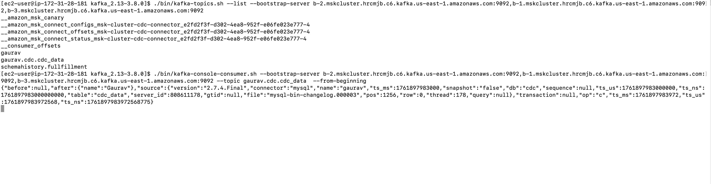
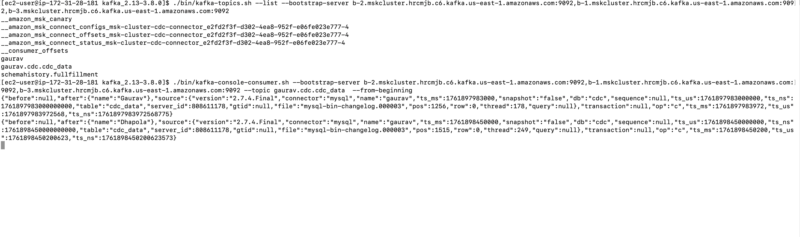

# Testing MSK CDC Pipeline

This guide shows you how to test the CDC (Change Data Capture) functionality after deploying your infrastructure.

---

## Prerequisites

- ✅ Infrastructure deployed successfully (RDS, MSK Cluster, MSK Connector)
- ✅ AWS credentials configured
- ✅ VPC and subnets available

---

## Step 1: Create Bastion Host (EC2 Instance)

To test and check topics in the MSK cluster, create a bastion host (client machine) in the same VPC.

### Create EC2 Instance

1. **Go to AWS Console** → EC2 → Launch Instance
2. **Configure:**
   - **AMI**: Amazon Linux 2
   - **Instance Type**: t2.micro (free tier)
   - **VPC**: Same VPC as MSK and RDS (should be tagged `default-vpc`)
   - **Subnet**: Public subnet (tagged `public-subnet-*`)
   - **Security Group**: Default VPC security group (or create one allowing SSH)
   - **Key Pair**: Select or create a key pair for SSH access
3. **Launch** the instance

---

## Step 2: Install Java and Kafka

SSH into your EC2 instance and install the required tools:

```bash
# SSH into EC2
ssh -i your-key.pem ec2-user@<ec2-public-ip>

# Install Java 11
sudo yum -y install java-11

# Download and extract Kafka (match your MSK version: 3.8.0)
export KAFKA_VERSION=3.8.0
wget https://archive.apache.org/dist/kafka/$KAFKA_VERSION/kafka_2.13-$KAFKA_VERSION.tgz
tar -xzf kafka_2.13-$KAFKA_VERSION.tgz

# Navigate to Kafka directory
cd kafka_2.13-$KAFKA_VERSION
```

---

## Step 3: Get MSK Broker Endpoints

Get your MSK cluster bootstrap servers:

```bash
# Using AWS CLI
aws kafka get-bootstrap-brokers \
    --cluster-arn <your-msk-cluster-arn> \
    --region us-east-1
```

Or get from AWS Console:
- Go to **MSK** → **Clusters** → Click your cluster → **View client information**
- Copy the **bootstrap servers** (plaintext or TLS)

Example endpoint:
```
b-1.msk-cluster.abc123.c2.kafka.us-east-1.amazonaws.com:9092,b-2.msk-cluster.abc123.c2.kafka.us-east-1.amazonaws.com:9092,b-3.msk-cluster.abc123.c2.kafka.us-east-1.amazonaws.com:9092
```

---

## Step 4: List Kafka Topics

Check what topics are available in your MSK cluster:

```bash
./bin/kafka-topics.sh --list \
    --bootstrap-server <broker-endpoints>
```

You should see topics created by Debezium CDC connector:
```
gaurav.cdc.your_table_name
schemahistory.fullfillment
```

---

## Step 5: Consume CDC Data from Kafka

Start consuming messages from the CDC topic:

```bash
./bin/kafka-console-consumer.sh \
    --bootstrap-server <broker-endpoints> \
    --topic gaurav.cdc.<table-name> \
    --from-beginning
```

### Expected Output

You'll see CDC events in JSON format:



The messages show:
- **before**: Previous state of the record
- **after**: New state of the record  
- **op**: Operation type (c=create, u=update, d=delete)
- **ts_ms**: Timestamp
- **source**: Source database info

---

## Step 6: Test Real-Time CDC

Now let's test real-time change data capture by inserting data into RDS.

### Connect to RDS

```bash
# Get RDS endpoint
aws rds describe-db-clusters \
    --db-cluster-identifier rds-cdc-cluster \
    --query 'DBClusters[0].Endpoint' \
    --output text

# Get password from Secrets Manager
aws secretsmanager get-secret-value \
    --secret-id <secret-arn> \
    --query 'SecretString' \
    --output text | jq -r '.password'

# Connect to MySQL
mysql -h <rds-endpoint> -u admin -p
```

### Insert Test Data

```sql
-- Switch to CDC database
USE cdc;

-- Create a test table (if not exists)
CREATE TABLE IF NOT EXISTS users (
    id INT AUTO_INCREMENT PRIMARY KEY,
    name VARCHAR(100),
    email VARCHAR(100),
    created_at TIMESTAMP DEFAULT CURRENT_TIMESTAMP
);

-- Insert new data
INSERT INTO users (name, email) VALUES ('John Doe', 'john@example.com');
INSERT INTO users (name, email) VALUES ('Jane Smith', 'jane@example.com');

-- Update existing data
UPDATE users SET email = 'john.doe@example.com' WHERE name = 'John Doe';

-- Delete data
DELETE FROM users WHERE name = 'Jane Smith';
```

### Watch Real-Time CDC

Switch back to your Kafka consumer terminal - you'll see the changes appear **within microseconds**!



Each operation (INSERT, UPDATE, DELETE) generates a CDC event that flows through:
```
MySQL RDS → Debezium Connector → MSK Kafka → Your Consumer
```

---

## Understanding CDC Messages

### INSERT Event
```json
{
  "before": null,
  "after": {
    "id": 1,
    "name": "John Doe",
    "email": "john@example.com",
    "created_at": "2024-01-01T10:00:00Z"
  },
  "op": "c",
  "ts_ms": 1704105600000
}
```

### UPDATE Event
```json
{
  "before": {
    "id": 1,
    "name": "John Doe",
    "email": "john@example.com"
  },
  "after": {
    "id": 1,
    "name": "John Doe",
    "email": "john.doe@example.com"
  },
  "op": "u",
  "ts_ms": 1704105660000
}
```

### DELETE Event
```json
{
  "before": {
    "id": 2,
    "name": "Jane Smith",
    "email": "jane@example.com"
  },
  "after": null,
  "op": "d",
  "ts_ms": 1704105720000
}
```

---

## Troubleshooting

### Issue: Can't connect to MSK from EC2

**Cause:** Security group rules not allowing traffic

**Fix:**
1. Verify EC2 is in the same VPC as MSK
2. Check MSK security group allows inbound on port 9092 from EC2's security group
3. Check EC2 security group allows outbound traffic

### Issue: No topics found

**Cause:** MSK connector might not be running

**Fix:**
```bash
# Check connector status
aws kafkaconnect list-connectors --region us-east-1
aws kafkaconnect describe-connector \
    --connector-arn <connector-arn> \
    --region us-east-1
```

Connector should be in `RUNNING` state.

### Issue: Can't connect to RDS

**Cause:** Security group rules or wrong endpoint

**Fix:**
1. Verify RDS security group allows inbound on port 3306
2. Verify you're using the cluster endpoint (not instance endpoint)
3. Check password is correct (retrieve from Secrets Manager)

---

## Monitoring CDC Performance

### Check Consumer Lag

```bash
./bin/kafka-consumer-groups.sh \
    --bootstrap-server <broker-endpoints> \
    --describe \
    --group <your-consumer-group>
```

### Check Connector Status

```bash
# Via AWS CLI
aws kafkaconnect describe-connector \
    --connector-arn <connector-arn> \
    --region us-east-1

# Check CloudWatch Logs
aws logs tail /aws/msk/msk-cluster --follow
```

---

## Cleanup

After testing, don't forget to:

1. **Terminate EC2 instance** (to avoid charges)
2. **Stop Kafka consumer**
3. **Run Jenkins pipeline** with `ACTION=destroy` to clean up all resources

---

## Useful Commands Reference

```bash
# List all topics
./bin/kafka-topics.sh --list --bootstrap-server <brokers>

# Describe a topic
./bin/kafka-topics.sh --describe --topic <topic-name> --bootstrap-server <brokers>

# Consume from beginning
./bin/kafka-console-consumer.sh --bootstrap-server <brokers> --topic <topic> --from-beginning

# Consume latest messages only
./bin/kafka-console-consumer.sh --bootstrap-server <brokers> --topic <topic>

# Consume with timestamp
./bin/kafka-console-consumer.sh --bootstrap-server <brokers> --topic <topic> --partition 0 --offset earliest

# Check consumer group lag
./bin/kafka-consumer-groups.sh --bootstrap-server <brokers> --describe --group <group-id>
```

---

## Architecture Flow

```
┌─────────────┐
│  MySQL RDS  │  (Source Database)
│   cdc DB    │
└──────┬──────┘
       │ binlog
       ▼
┌─────────────┐
│  Debezium   │  (CDC Connector)
│  Connector  │
└──────┬──────┘
       │ CDC Events
       ▼
┌─────────────┐
│ MSK Kafka   │  (Message Broker)
│  3 Brokers  │
└──────┬──────┘
       │ Topics
       ▼
┌─────────────┐
│  Consumer   │  (Your Application / EC2)
│  (Bastion)  │
└─────────────┘
```

---

## Next Steps

Now that CDC is working:

1. **Build real consumers** in your application (Java, Python, Node.js)
2. **Process CDC events** for downstream systems
3. **Set up monitoring** with CloudWatch
4. **Implement error handling** and retry logic
5. **Scale consumers** as needed
6. **Add data transformation** logic if needed

---

## Additional Resources

- [Debezium MySQL Connector Docs](https://debezium.io/documentation/reference/stable/connectors/mysql.html)
- [AWS MSK Documentation](https://docs.aws.amazon.com/msk/)
- [Kafka Consumer Guide](https://kafka.apache.org/documentation/#consumerconfigs)

---

**🎉 Congratulations!** You've successfully tested CDC from MySQL to Kafka!
